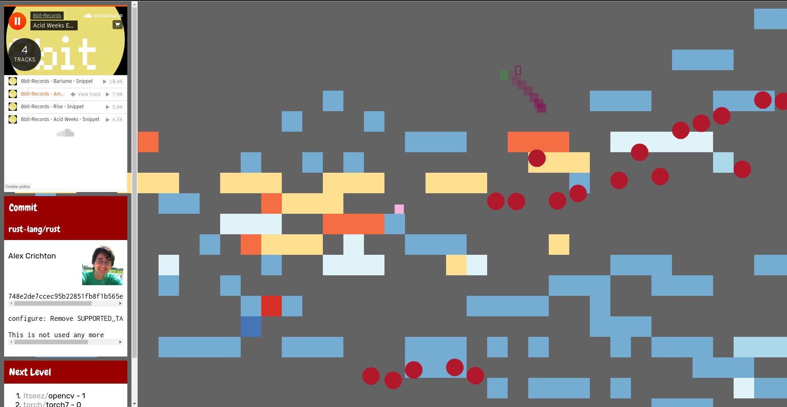

# virtual_hackaton: Git-Viz!

## Goal:
Platformer game randomly generated from git repositories.
Uses commit history as input.
Jump from tile to tile and discover the underlying commit.
Made in 48 hours

setup:
```sh
./bootstrap.sh
cd server
./start_server.sh
```
connect to localhost:3000 and wait!

## Technology
* Node.js
* mongodb
* ES6
* Github API, Soundcloud API

## screens:



